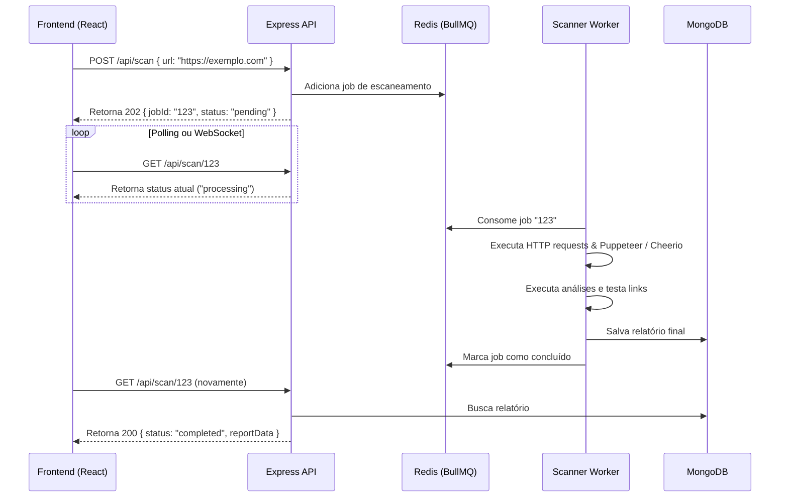

# 🌐 Sistema de Escaneamento de Sites (Webscan)

Planejamento estratégico e arquitetura técnica para uma solução robusta e moderna de escaneamento de sites, focada em performance, análise estrutural e SEO.

---

## 1. Arquitetura Técnica e Stack

Propomos uma arquitetura baseada em microsserviços/módulos bem definidos e desacoplados, visando escalabilidade horizontal e eficiência no processamento de requisições pesadas de I/O.

### Backend (Node.js & Express com TypeScript)
O backend funcionará como uma API Gateway e orquestradora de tarefas. 
*   **Camada de Controladores (Controllers):** Recebe a URL, valida o formato e inicia a fila de escaneamento.
*   **Fila de Processamento (BullMQ + Redis):** Indispensável para evitar gargalos na API. O Express enfileira o job e responde imediatamente `202 Accepted` com um ID de tarefa.
*   **Workers Assíncronos:** Processos isolados que consomem os jobs da fila de forma assíncrona, executando o crawling sem congelar a API HTTP.

### Bibliotecas de Crawling e Análise
*   **[Axios](https://github.com/axios/axios):** Para requisições rápidas iniciais, verificação de headers HTTP, tamanho do payload e tempo de resposta base (TTFB).
*   **[Cheerio](https://github.com/cheeriojs/cheerio):** Para parsing ultra-rápido do HTML retornado pelo Axios. Ideal para extrair metadados, tags `alt` de imagens e links da página atual de maneira eficiente e de baixíssimo consumo de memória.
*   **[Puppeteer](https://github.com/puppeteer/puppeteer):** Para renderização de aplicações dinâmicas (Single Page Applications) e para analisar se há links quebrados carregados dinamicamente via JS. *Nota: Deve ser usado apenas quando necessário ou em planos premium devido ao alto custo de CPU/RAM.*
*   **[Lighthouse](https://github.com/GoogleChrome/lighthouse):** Utilização da biblioteca do Lighthouse no backend para extrair métricas cruciais de Web Vitals (LCP, FID, CLS, Speed Index) e pontuações consolidadas.

### Estrutura de Banco de Dados (MongoDB via Mongoose)
Utilizaremos o MongoDB para persistência de dados flexíveis oriundos das análises estruturais e métricas dinâmicas.

```typescript
// Estrutura conceitual das Coleções no MongoDB (Mongoose)

interface IScanReport {
  userId?: mongoose.Types.ObjectId;
  url: string;
  status: 'pending' | 'processing' | 'completed' | 'failed';
  score: {
    seo: number;
    performance: number;
    bestPractices: number;
    accessibility: number;
  };
  metrics: {
    loadTimeMs: number;
    pageSizeBytes: number;
    httpStatus: number;
  };
  seoData: {
    title?: string;
    description?: string;
    images: Array<{ src: string; alt?: string; hasAlt: boolean }>;
    headings: { h1: string[]; h2: string[]; h3: string[] };
  };
  links: Array<{ url: string; text: string; status: number; isBroken: boolean }>;
  createdAt: Date;
  completedAt?: Date;
}
```

---

## 2. Especificação de Fluxo (Backend)

O processamento é assíncrono para garantir estabilidade e resiliência a timeouts.



### Dados Exatos a Extrair por Página:
1.  **Meta Tags:** `title`, `description`, `og:image`, `robots`, viewport.
2.  **Validação de Imagens:** URLs de todas as imagens e validação rigorosa de presença do atributo `alt` preenchido.
3.  **Links e Status HTTP:** Crawling de links internos e verificação de status HTTP (200, 301, 404, 500) para mapeamento de links quebrados.
4.  **Performance:** Tempo de resposta (TTFB), First Contentful Paint (FCP) e estimativa de tamanho total da página.

---

## 3. Interface e UX (Frontend)

Com foco em uma experiência do usuário extremamente premium, dinâmica e adaptável (*Mobile-First*), o frontend utilizará paletas modernas de HSL e transições suaves.

### Componentes de Visualização (React)
*   **Bento Grid de Visão Geral:** No desktop, uma grade responsiva com cartões dinâmicos que mostram os scores consolidados de SEO, Performance e Acessibilidade em anéis de progresso SVG customizados (sem bibliotecas pesadas de gráficos desnecessárias).
*   **Status Cards de Diagnóstico:** Cartões expansíveis detalhando avisos (Ex: H1s duplicados ou ausentes, Imagens sem `alt`).
*   **Interactive Link Table:** Tabela virtualizada com paginação e filtros rápidos para listar todos os links, destacando em vermelho HSL (`hsl(0, 84%, 60%)`) os links quebrados (404).

### Micro-animações e Transições Dinâmicas (Framer Motion)
*   **Scanning Pulse Loader:** Na fase de carregamento, um efeito radar com gradientes HSL rotacionando ao redor da URL sendo analisada, mantendo o usuário engajado com animações de texto indicando a etapa atual (ex: *"Extraindo metadados..."*, *"Testando links quebrados..."*).
*   **Cascading Reveal:** Quando os resultados estiverem prontos, os cartões do Bento Grid aparecerão em cascata suave (`staggerChildren`) de baixo para cima com efeito de atenuação e leve escala.
*   **Interactive Score Counter:** Efeito de contagem progressiva (`0` a `100`) para as notas de performance, utilizando valores animados integrados aos anéis circulares.

---

## 4. Plano de Execução em Sprints

### 🚀 Sprint 1: Setup e Core de Escaneamento (Backend)
- [x] Configuração do workspace com TypeScript estrito (`tsconfig.json` rígido).
- [] Estruturação do servidor Node.js com Express e BullMQ + Redis para tarefas de background.
- [] Desenvolvimento da biblioteca do Crawler interno utilizando Axios + Cheerio para leitura rápida e Puppeteer opcional.
- [] Mapeamento e teste de links internos para verificar status code HTTP (links quebrados).
- [] Testes de integração locais para validar a extração do payload em formato JSON limpo.

### 💾 Sprint 2: Banco de Dados e Histórico
- [ ] Instalação e configuração do Mongoose com MongoDB.
- [ ] Criação dos schemas de Relatórios (`ScanReport`) e Usuários com tipagem TypeScript estrita e sem `any`.
- [ ] Implementação das rotas de CRUD: `POST /api/scan` (cria fila), `GET /api/scan/:id` (retorna progresso/resultado) e `GET /api/scans` (histórico geral).
- [ ] Tratamento de erros completo em todas as etapas de processamento com logs detalhados e retorno estruturado para o frontend.

### 🎨 Sprint 3: UI/UX Premium, Bento Grid e Animações
- [ ] Setup do Frontend Mobile-First com Vite + React + TypeScript.
- [ ] Criação do sistema de design tokens em variáveis CSS customizadas baseadas em HSL (evitando classes utilitárias redundantes).
- [ ] Componente da Tela de Busca de URL com tratamento e validação em tempo real.
- [ ] Desenvolvimento da tela de "Scanning" com micro-animações do Framer Motion e atualização de progresso via polling/sockets.
- [ ] Desenvolvimento da tela de resultados com Bento Grid responsivo, contadores de score dinâmicos e tabela iterativa de links.
- [ ] Testes de usabilidade e compatibilidade responsiva.

---

## 💡 Próximos Passos
> [!NOTE]
> Você gostaria de aprovar este plano técnico e iniciar o setup da **Sprint 1** (Backend, TypeScript Strict, Redis e Crawler com Axios/Cheerio)?
